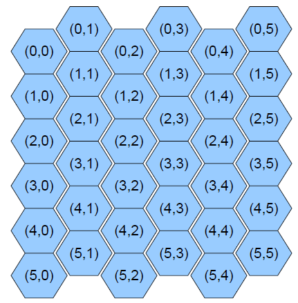

### Problem mz07-1: mz07-1

Опишите абстрактный класс ```Figure```, который будет корнем полиморфной иерархии классов, описывающих двухмерные фигуры.

Класс должен определять метод ```get_square``` для перекрытия в производных классах. Метод будет возвращать площадь соответствующей фигуры.

### Problem mz07-2: mz07-2

Дан абстрактный класс ```Figure``` (см. предыдущую задачу).

Опишите классы ```Rectangle```, ```Square```, ```Circle```, наследующие класс ```Figure```. Классы должны хранить параметры фигуры, а площадь каждый раз должна вычисляться. Для окружности хранится ее радиус.

Для создания объектов соответствующих классов каждый класс должен определять статический метод ```make```, который в качестве параметра принимает строку ```std::string```. Метод ```make``` возвращает указатель на объект, созданный в куче.

Для класса ```Rectangle``` строка содержит два вещественных числа, разделенных пробелами, а для классов ```Square``` и ```Circle``` — одно вещественное число.

### Problem mz07-3: mz07-3

Даны классы ```Figure```, ```Rectangle```, ```Square```, ```Circle``` (см. предыдущие задачи).

Дополнительно для всех фигур определен метод ```to_string```, который возвращает строку ```std::string```, описывающую данную фигуру.

Для класса ```Rectangle``` строка имеет вид

```
R WIDTH HEIGHT
```

Для класса ```Square``` строка имеет вид

```
S SIZE
```

Для класса ```Circle``` строка имеет вид

```
C RADUIS
```

Где ```WIDTH```, ```HEIGHT```, ```SIZE```, ```RADUIS``` — соответствующие параметры фигуры.

Напишите программу. На стандартном потоке ввода подаются описания фигур, строго по одной фигуре на строку текста. Строка описания фигуры имеет вид

```
TYPE PARAMS
```

Где ```TYPE``` — это ```R```, ```S``` или ```C``` обозначающие соответствующие фигуры. ```PARAMS``` — это параметры создания фигуры, без изменения передаваемые в функцию ```make```. Элементы в строке могут разделяться произвольным количеством пробельных символов.

На стандартный поток вывода выведите фигуры, отсортированные в порядке возрастания площади фигур. Если несколько фигур имеют равную площадь, сохраняется их относительный порядок из входных данных.

**Указания**

Не используйте глобальные переменные!

Для чтения строки текста из входного потока используйте ```std::getline```.

Для покомпонентного чтения из строки можете использовать ```std::istringstream``` (опционально).

Для хранения фигур используйте ```std::vector```. Для стабильной сортировки используйте ```stable_sort```.

Не забывайте корректно освобождать всю динамическую память.

Реализуйте класс-фабрику классов для порождения объектов фигур. Фабрика классов должна быть синглтоном. Экземпляр синглтона должен возвращаться статической функцией ```factory_instance```.

Для автоматического освобождения памяти используйте ```std::unique_ptr```.

Чтобы не использовать ```if``` для проверки типа реализуйте фабрику классов на основе ```std::map``` и ```std::function```.

### Problem up07-4: mz07-4

Дано прямоугольное поле из гексагональных элементов (см. рис) размером ```m``` строк на ```n``` столбцов клеток. Координаты шестиугольников определяются, как показано на рисунке.



Из некоторой клетки можно перейти за один ход в любую из шести соседних клеток.

Расстояние между двумя клетками — это минимальное число ходов, за которое можно перейти из одной клетки в другую.

В пространстве имен Game напишите шаблонный класс ```Coord```, параметризованный типом координат. Класс должен содержать открытый тип ```value_type```, открытые поля ```row```, ```col``` и открытый конструктор от 0, 1 или 2 аргументов.

В пространстве имен Game напишите шаблонную функцию ```dist```, принимающую три параметра: размеры поля, две координаты клеток, которая вычисляет расстояние между двумя клетками.

### Problem mz07-5: mz07-5

Опишите абстрактный класс ```Figure```, который будет корнем полиморфной иерархии классов, описывающих двухмерные фигуры.

Класс должен определять метод ```equals``` для перекрытия в производных классах. Метод будет принимать указатель на фигуру и возвращать ```true```, если фигуры равны.

Напишите классы ```Rectangle``` с конструктором от двух целых (```int```) аргументов и ```Triangle``` с конструктором от трех целых (```int```) аргументов. Для этих классов определите методы ```equals```. Равенство фигур понимается как равенство соответствующих сторон, то есть прямоугольник (10, 5) не равен прямоугольнику (5, 10).

Иерархия должна быть расширяемой, то есть добавление нового класса-наследника ```Figure``` должно не ломать существующий код и не требовать его модификации.

Например,

```c++
Rectangle r1(10, 5), r2(10, 2), r3(10, 5), r4(5, 10);
Triangle t1(1, 2, 3);
Figure *f = &r1;

assert(!f->equals(&r2));
assert(f->equals(&r3));
assert(!f->equals(&r4));
assert(!f->equals(&t1));
assert(!f->equals(nullptr));
```
